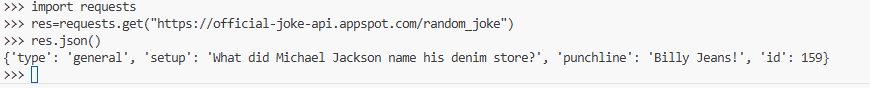

Homework 1 README:

to test this project, 
  cd into homework1/ 
  then run: python -m pytest

for task 7 I choose to look into requests at https://requests.readthedocs.io/en/latest/
this module allows you to make easy http requests. I really enjoyed how readable this library
is and how easy it makes requests in python.

here is the test my mock trial is based on:

